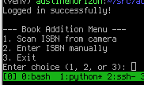

# ESP32 Library System

A comprehensive library management system built around ESP32 microcontrollers, featuring a REST API server, a VGA client interface, and tools for adding books via ISBN scanning.

## Overview

This project consists of three interconnected components that work together to create a complete library management solution:

1. **ESP32 Library API** - A REST API server running on ESP32 with web interface
2. **ESP32 VGA Catalog Client** - A rich client application with VGA output using TTGO shield
3. **Add Book to Catalog** - A Python script for adding books via ISBN scanning

## Components

### 1. ESP32 Library API

A comprehensive REST API running on ESP32 microcontroller for managing a book library with an integrated web interface.

[Read More →](esp32_library_api/README.md)

### 2. ESP32 VGA Catalog Client

A rich client application running on ESP32 with VGA output using the TTGO VGA shield (v1.4), providing an interactive library catalog interface with keyboard navigation.

[Read More →](esp32_vga_catalog_client/README.md)

### 3. Add Book to Catalog

A Python script for adding books to the ESP32 library system by scanning ISBN barcodes with a webcam or entering ISBN manually.

[Read More →](add_book_to_catalog/README.md)

## Architecture

The system is designed with a client-server architecture:

- The **ESP32 Library API** serves as the central server, storing book data in an SQLite database on an SD card and providing a REST API for data operations
- The **ESP32 VGA Catalog Client** connects to the API server to browse and search the library catalog
- The **Add Book to Catalog** script provides a convenient way to add new books to the system by scanning ISBN barcodes

## Hardware Requirements

- Multiple ESP32 development boards
- TTGO VGA Shield v1.4 for the client
- SD cards for database storage
- PS/2 Keyboard for VGA client
- Webcam for ISBN scanning
- Network connectivity (WiFi/Ethernet)

## Software Dependencies

- Arduino IDE with ESP32 board support
- FabGL library (version 2.0.8) for VGA client
- SQLite3 library for ESP32
- Python 3.6+ for the ISBN scanning tool
- Various Python libraries (OpenCV, PyZBar, Requests, etc.)

## Setup

Each component has its own setup instructions:

1. [Setup ESP32 Library API](esp32_library_api/README.md#setup)
2. [Setup ESP32 VGA Catalog Client](esp32_vga_catalog_client/README.md#setup)
3. [Setup Add Book to Catalog](add_book_to_catalog/README.md#setup)

## Contributing

Feel free to fork this repository and submit pull requests for improvements or bug fixes.

## License

This project is open source and available under the MIT License.