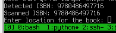
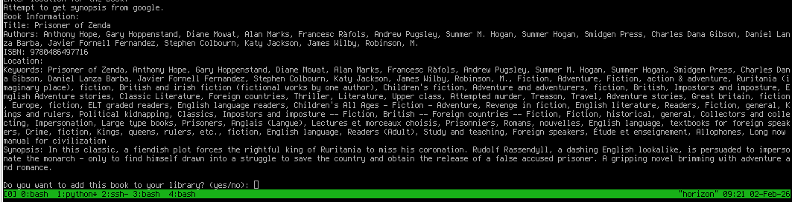

# Add Book to Catalog

A Python script for adding books to the ESP32 library system by scanning ISBN barcodes with a webcam or entering ISBN manually. Retrieves book information from online sources and adds it to the library database.

## Features

- **Barcode Scanning**: Uses webcam to scan ISBN barcodes (EAN-13 format)
- **Manual Entry**: Option to enter ISBN manually
- **Online Lookup**: Retrieves book information from Open Library, Google Books, and ThriftBooks
- **Interactive Menu**: User-friendly menu system for continuous book addition
- **API Integration**: Connects to ESP32 library API to add books
- **Authentication**: Handles admin authentication for the library API

## Requirements

- Python 3.6+
- Webcam for barcode scanning
- Internet connection for online lookups
- Access to ESP32 library API

### Python Dependencies

Install the required packages using pip:

```bash
pip install opencv-python pyzbar numpy requests beautifulsoup4
```

## Setup

1. **Install Dependencies**:
   ```bash
   pip install -r requirements.txt
   ```

2. **Configure API Endpoint**:
   - Update the `BASE_URL` in `add_by_isbn.py` with your ESP32 library API IP address:
     ```python
     BASE_URL = "http://YOUR_ESP32_IP_ADDRESS"
     ```

3. **Configure Admin Credentials**:
   - Update the admin username and password in the login function:
     ```python
     login_data = {
         'username': 'admin',  # Your admin username
         'password': 'YOUR_ADMIN_PASSWORD'   # Your admin password
     }
     ```

## Usage

### Interactive Mode (Recommended)

Run the script without arguments to use the interactive menu:

```bash
python add_by_isbn.py
```

The interactive menu allows you to:
- Scan ISBN from camera
- Enter ISBN manually
- Add multiple books without re-authenticating

### Command Line Mode

Add a single book by providing ISBN and location as arguments:

```bash
python add_by_isbn.py [ISBN] [LOCATION]
```

Example:
```bash
python add_by_isbn.py 9780134685991 "Living Room Shelf A"
```

## Barcode Scanning

The script uses OpenCV and PyZBar to detect and decode barcodes from your webcam feed:

1. The camera window will open when scanning mode is activated
2. Position the ISBN barcode within the camera view
3. The script will automatically detect and decode EAN-13 barcodes
4. Press 'q' to quit the camera window if needed

## Online Data Sources

The script retrieves book information from multiple sources:

1. **Open Library**: Primary source for basic book information
2. **Google Books**: Used as fallback for synopsis/description
3. **ThriftBooks**: Alternative source for synopsis/description

## Data Retrieved

For each book, the script collects:
- Title
- Author(s)
- ISBN
- Location (provided by user)
- Keywords (derived from title, authors, and subjects)
- Synopsis/Description

## API Integration

The script communicates with the ESP32 library API to add books:
- Authenticates as admin user
- Formats book data according to API requirements
- Sends POST request to `/add` endpoint
- Handles success/error responses

## Images






## Troubleshooting

- If barcode scanning doesn't work, ensure good lighting and clear view of the barcode
- If online lookups fail, check internet connectivity
- If API communication fails, verify the ESP32 library API is accessible and credentials are correct
- If camera doesn't initialize, check camera permissions and availability